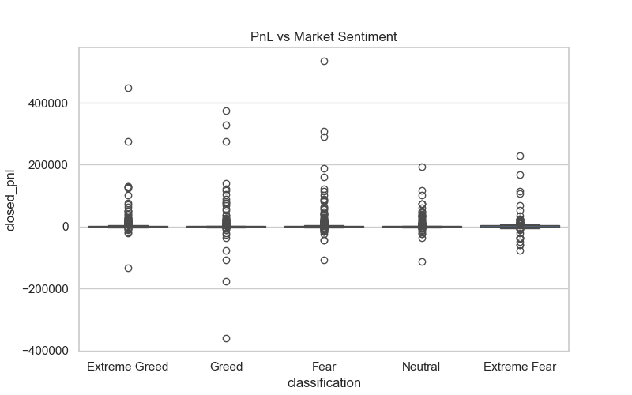
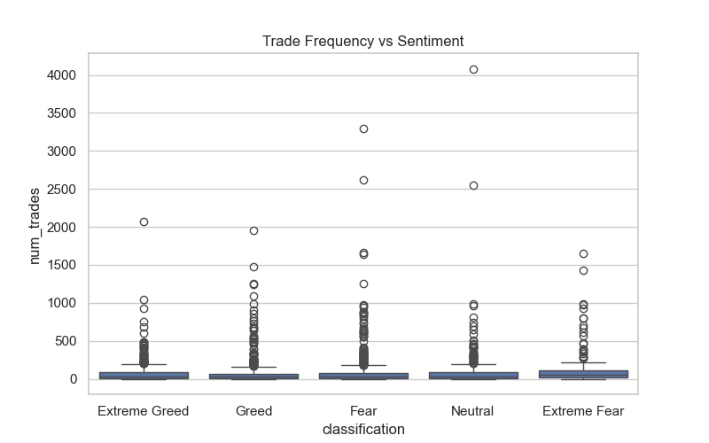
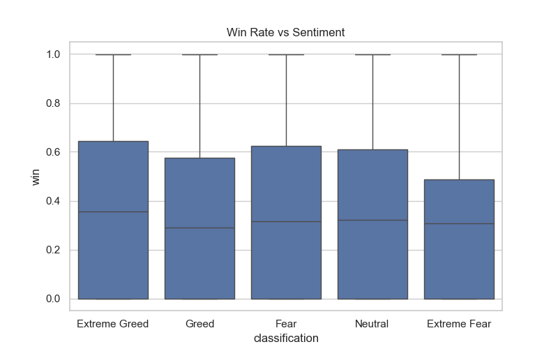
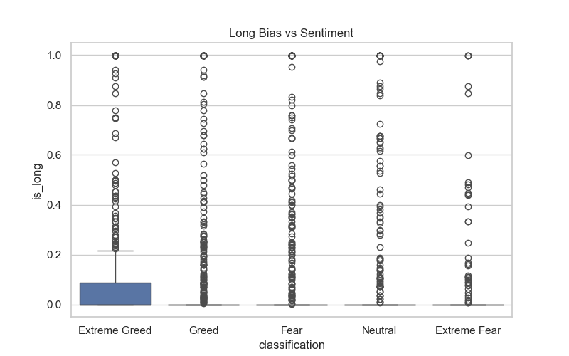

# Trader Performance vs Market Sentiment Analysis

This project analyzes how Bitcoin market sentiment (Fear/Greed Index) influences trader behavior and performance using historical trading data.

The goal is to uncover patterns and derive actionable trading strategies based on sentiment-driven market conditions.

---

## Project Overview

This analysis explores:

- How trader profitability varies across sentiment (Fear vs Greed)
- Behavioral changes such as trade frequency and position bias
- Segmentation of traders based on activity and consistency
- Predictive modeling for trader profitability

---

## Dataset

1. **Bitcoin Fear & Greed Index**
   - Daily sentiment classification (Fear, Greed, etc.)

2. **Historical Trader Data**
   - Trade-level data including:
     - Account
     - Trade size
     - Direction
     - Closed PnL
     - Timestamp

---

## Methodology

1. Data Cleaning & Preprocessing  
2. Date Alignment (Daily Level)  
3. Feature Engineering:
4. Data Merging (Sentiment + Trading Data)  
5. Exploratory Data Analysis  
6. Trader Segmentation  
7. Predictive Modeling (Random Forest)

---

## Key Visualizations

### PnL vs Market Sentiment




---

### Trade Frequency vs Sentiment




---

### Win Rate vs Sentiment




---

### Long/Short Bias




---

## Predictive Modeling

A **Random Forest classifier** was trained to predict trader profitability.

### Results:
- Accuracy: **94.87%**
- Strong recall for profitable trades (99%)
- Minimal false negatives

This demonstrates that trader behavior combined with sentiment has strong predictive power.

---

## Answers to Key Questions

### 1. Does performance differ between Fear vs Greed?

Yes.  
- Highest PnL occurs during Extreme Greed (~418)  
- Lowest PnL occurs during Fear (~108)  
- Win rate is also highest during Extreme Greed (~38.6%) and lowest during Extreme Fear (~33%)

This indicates that trader performance improves significantly during bullish sentiment.

---

### 2. Do traders change behavior based on sentiment?

Yes.  
- Trade frequency is highest during Extreme Fear (~133 trades/day), indicating panic-driven activity  
- Long bias increases from ~7% (Extreme Fear) to ~14% (Extreme Greed)  
- Win rate drops during Fear conditions  

This shows strong behavioral shifts driven by sentiment.

---

### 3. Key trader segments

- High-frequency traders → more volatile, overactive in Fear  
- Low-frequency traders → more stable  
- Consistent traders → lower variance, more predictable returns  

Different segments behave differently across sentiment conditions.

---

### 4. Key insights

- Extreme Greed leads to highest profitability  
- Extreme Fear leads to overtrading but poor outcomes  
- Sentiment strongly influences trade direction  

These insights highlight the importance of adapting strategies based on sentiment.

---

## Strategy Recommendations

### Strategy 1: Avoid Overtrading During Extreme Fear
- Reduce trade frequency
- Focus on high-confidence trades
- Avoid panic-driven decisions

### Strategy 2: Leverage Bullish Momentum During Extreme Greed
- Increase participation during strong trends
- Maintain risk control to avoid overexposure

---

## Limitations

- Analysis is based on historical data and may not generalize to all market conditions.

---

## How to Run

1. Install Dependencies
```bash
pip install -r requirements.txt
```

2. Launch jupyter notebook
```bash
jupyter notebook
```

3. Open the notebook
Open:
```bash
notebooks/analysis.ipynb
```

---


## 👨‍💻 Author

**Ayush Shukla**  

🔗 LinkedIn: https://www.linkedin.com/in/ayushshukla135/
